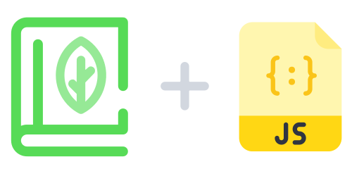

# Sage.js

**Sage.js** is the simple, lightweight and awesome Sage client for JS.

## Overview

In any project that you use Sage, you'll need a client which manages your data requirements, handles queries, networking and the local state of your data. This is where **Sage.js** shines!

## Features

-   #### Declarative & effective data fetching for Sage

    -   Simply manage your data requirements.
        -   Describe your app’s data requirements as queries.
        -   Satisfy them with the data your Sage API returns.
        -   Keep the data fresh.
    -   Write a single query and receive data without manually tracking loading states.
    -   Keep a local state of your data with the built-in cache.

-   #### Incrementally adoptable

    -   Drop Sage.js into any JavaScript app and incorporate it feature by feature.

-   #### Universally compatible

    -   Use any build setup and any Sage API.
    -   Isomorphic.
    -   Runs on most browsers.
    -   No dependencies, plain vanilla JavaScript.
    -   You don't need to install Node.js ecosystem on your computer.

-   #### Community driven

    -   Share knowledge with the community of Sage protocol.

## Installation

You can download `sage.js` directly, and start using it. That’s it!

- [Development Version](https://raw.githubusercontent.com/dorkodu/sage.js/master/sage.js)
- [Production Version](https://raw.githubusercontent.com/dorkodu/sage.js/master/sage.min.js)

## Documentation

The documentation can be found at: **[docs/](docs)**

## License

Sage.js is licensed under the [MIT License](LICENSE).

Copyright (c) 2021 Dorkodu — [dorkodu.com](https://dorkodu.com)
